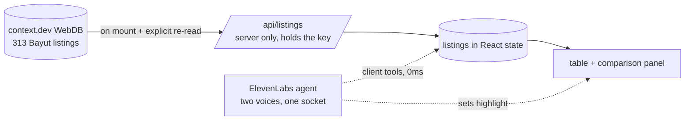

# Second Opinion

A voice agent that reads Dubai rental listings and tells you when the same apartment is being
advertised twice at different prices.

Ask it about a community and it answers in about a second. When the listings it's about to mention
include the same physical flat listed by two different agencies, it says so without being asked.
When a listing is missing the facts you'd need to judge it — no agency name, no posting date — it
switches to a different, audibly less certain voice and names what's missing.

It sides with the renter. It will tell you what to check. It won't tell you what to do, won't judge
whether a price is good, and won't speculate about why two agencies have the same flat at a
different number.

**Repo:** https://github.com/andreteow/dubai-voice-hackathon

---

## What's actually in the data

313 rental listings scraped from Bayut into a context.dev WebDB collection, re-synced every 10
minutes. Concentrated in Business Bay, Dubai Marina, Downtown Dubai, Dubai Hills Estate and
Za'abeel, with a long tail of ~40 smaller communities.

Measured against the live collection:

| | |
|---|---|
| Listings | 313 |
| Exact duplicate groups | 30, covering 67 listings — **21% of the table is a repeat** |
| Probable duplicates (within 3 sqft) | 20 more groups |
| Listings too thin to trust | 50 (16%) — 39 with no posting date, 15 with no agency |
| Widest credible rent gap | Imperial Avenue, 1BR, 855 sqft: AED 110,000 / 130,000 / 145,000 |
| Same flat, same agency, two prices | 2 groups |

The Imperial Avenue example is one apartment of one size in one building, listed three times by two
agencies, 35,000 dirhams apart end to end. Nothing on the portal indicates those are the same flat.

---

## Setup

Assumes a clean machine. Node 20+ and pnpm 9+ are the only prerequisites.

```bash
# 1. Install pnpm if you don't have it
corepack enable && corepack prepare pnpm@latest --activate

# 2. Clone and install
git clone https://github.com/andreteow/dubai-voice-hackathon.git
cd dubai-voice-hackathon
pnpm install

# 3. Environment
cp .env.example .env.local
```

Fill in two keys in `.env.local`:

| Var | Where to get it | Used by |
|---|---|---|
| `CONTEXT_DEV_API_KEY` | context.dev dashboard | The server route that reads the listings |
| `ELEVENLABS_API_KEY` | ElevenLabs → Settings → API Keys | The agent provisioning script only |

```bash
# 4. Create the voice agent from the committed config.
#    Idempotent — safe to re-run. Prints the agent id.
pnpm sync-agent

# 5. Paste that id into .env.local
#    NEXT_PUBLIC_ELEVENLABS_AGENT_ID=agent_xxxxxxxxxxxx

# 6. Run
pnpm dev
```

Open http://localhost:3000. The table populates on load, then click the voice widget and ask
"what's a one-bed in Marina going for?"

**Wear headphones.** On laptop speakers the agent hears its own output and interrupts itself.

### Other commands

```bash
pnpm test          # unit tests over the pure logic in lib/listings/
pnpm check-hero    # prints every material duplicate group in the live data
```

`pnpm check-hero` runs the *same* `groupDuplicates` function the app uses, so if it reports a good
example, the app will find it too. Run it before demoing — the collection re-syncs every 10 minutes
and listings come and go.

---

## Architecture

The whole design exists to protect one property: **no network call happens while you're talking to
it.**

The listings are read once from context.dev through a server route when the page mounts, normalised
into typed records, and held in React state. The ElevenLabs agent's tools are *client* tools — they
execute synchronously inside the page against that in-memory array. A voice turn touches no server,
so answers come back in roughly the time it takes to speak them. The same tool call that answers the
question also sets the React state driving the screen, so the speech and the table move together
rather than racing.



The dotted arrows never leave the browser. The solid ones run exactly twice: once on load, and again
only if you ask it to re-read.

Three consequences worth knowing before you read the code:

- **The context.dev key never reaches the browser.** One server route proxies the query; the client
  receives normalised listings and never a credential.
- **Every judged decision is a pure function.** Normalisation, trust classification and duplicate
  grouping live in `lib/listings/` with no I/O, and they're the only things with tests. The voice
  agent and the UI are verified by talking to them.
- **The agent config is committed, not clicked.** Its prompt, tool schemas and voice labels live in
  `agent/second-opinion.json` and are applied by `pnpm sync-agent`, so a change in how the agent
  behaves shows up as a diff rather than as an undocumented dashboard edit.

### Layout

```
app/api/listings/route.ts   reads context.dev, normalises, returns { listings, readAt }
app/page.tsx                the single screen
components/                 ListingsTable, DuplicateComparison, VoiceWidget
lib/listings/
  normalize.ts              raw strings -> typed Listing        (tested)
  trust.ts                  which listings are too thin to rely on (tested)
  duplicates.ts             which listings are the same apartment  (tested)
agent/second-opinion.json   the agent, in version control
scripts/check-hero.ts       pre-demo verification
```

## How it decides things

**Two listings are the same apartment** when they share a building, a bedroom count and a size. An
exact size match is stated as fact; a match within 3 square feet is stated as *probable* and never as
fact. The 3 sqft tolerance is absolute rather than a percentage, because the near-misses in the real
data are rounding artifacts that don't scale with unit size — 1625 vs 1626, 851 vs 852 — while 3% of
a 1,723 sqft unit is a different floor plan.

**A listing is too thin to trust** when it names no agency, has no posting date, has a date that
can't be parsed, or states no size. That's it — four named, checkable defects. It deliberately does
*not* key on the extractor's confidence score: the observed range across this collection is 0.68–0.95
and clusters tightly in the middle, too narrow for any threshold to mean much — and "I'm 78% sure"
isn't something a listener can verify. A missing posting date is.

**Bedroom formatting is never a defect.** The source writes the same thing as `1`, `1 Bed`, `2`,
`2 Beds` and `Studio` — 111 of 313 rows use a worded form. Those are normalised to integers on load.
Treating the variance as a data problem instead would push the hedge rate from 16% to 52% and make
the uncertain voice meaningless through repetition.
