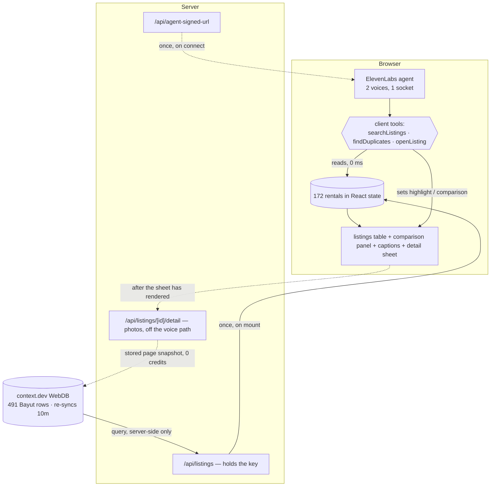

# Second Opinion — Technical Specification

Dubai AI Hub Builder Lab #3 · Voice Agents Hackathon · 8 August 2026

Figures below were measured against the live collection at 12:45 GST. The collection re-syncs every
ten minutes and was still growing during the build, so counts drift; `npm run check-hero` prints
the current ones.

---

## 01 · Problem

**Who.** Someone renting an apartment in Dubai, comparing listings on a portal, about to call an
agent about one of them.

**The pain.** The same physical apartment appears on the portal more than once. Different agencies
list the same unit, sometimes at materially different rents, and nothing on the page indicates they
are the same flat.

Measured on the live data: of **172 rentals held in memory, 21 sit inside a duplicate group** —
about one listing in eight is a repeat of another. Ten groups, four with a gap worth remarking on.
The widest right now is a two-bedroom at Grande, 1,271 sqft, listed at **AED 160,000 by one agency
and AED 230,000 by another**. Someone calling about the second one is negotiating against a number
another agency already beat by seventy thousand.

The listings are also unevenly published. **26 of 172 carry no posting date and 6 name no agency**,
so you cannot tell a fresh listing from one that has sat unclaimed for months — which is exactly
the signal that tells you whether an asking price is real.

Existing tools optimise for search. They are good at showing you more listings. None of them tell
you that two of the results are one apartment.

**Why voice.** Two reasons, and only the second is interesting.

The weak one: this happens while you are doing something else — walking a building, sitting in a
car outside a viewing, on hold with an agency.

The real one: **the product's core output is a confidence signal, and voice carries confidence in a
channel text does not have.** A screen can print "71% confident", but the reader has to stop,
decode it, and decide what it means. A voice that audibly changes speaker on one clause says the
same thing before you have finished hearing the sentence, and costs you no attention. The thing
this product most needs to communicate — *don't lean on this one* — is precisely what speech does
better than text. That is what makes it a voice product rather than a web app with a microphone
attached.

---

## 02 · Architecture

One property governs every decision: **no network call occurs inside a voice turn.**

`/web/search` on context.dev measures 2–4 seconds under live probing. Any design shaped *user asks
→ search → answer* produces audible dead air, and dead air is what makes voice demos feel broken.
So the read moves out of the conversational path entirely: listings are fetched once when the page
mounts, normalised into typed records, and held in React state for the session.

The agent's tools are **client** tools, not server tools. They execute synchronously in the browser
against that in-memory array. A voice turn therefore makes **zero HTTP requests** — and because the
same function call that answers the question also sets React state, the screen and the speech move
together instead of racing.



**No arrow crosses the Browser boundary during a conversation.** The solid arrows are the read on
mount, a signed URL when you press talk, and an explicit "read again".

The dotted arrow to `/api/listings/[id]/detail` is the one exception, and it is off the voice path
by construction: opening a listing renders the whole panel from memory first — specs, trust verdict,
comparables, the same flat advertised elsewhere — and only then fetches photographs into a skeleton.
No turn awaits it. It reads the page context.dev's crawler already stored rather than visiting
Bayut, which both costs nothing and is the only way to get the photos at all: Bayut serves a captcha
to anything fetching a detail page on demand.

**Stated plainly, because it cuts both ways: the agent does not see data that changes
mid-conversation.** It answers from the snapshot taken at page load. That is a deliberate trade —
sub-second answers and immunity to venue wifi, bought with staleness bounded by how long the tab
has been open. The re-read button exists for exactly that, and the agent always states when it last
read. A design that re-queried per turn would be more live and materially worse to talk to.

The pipeline below is the core three pure functions, and they hold every judged decision:

```
raw row (every field a string)
  → normalize()        "1 Bed"→1, "Studio"→0, "AED 76,000"→76000, missing size→null (never 0)
  → classifyTrust()    → { trusted, reasons: no_agency | no_date | unreadable_date | no_size }
  → groupDuplicates()  → identical size → stated as fact
                       → within 3 sqft  → stated as probable, in the uncertain voice
```

Three decisions inside that are load-bearing, and each was made by measurement:

**Duplicate tolerance is an absolute 3 sqft, not a percentage.** Across 43 same-building,
same-bedroom adjacent pairs: 16 matched exactly, 10 differed by 1–3 sqft *regardless of unit size*
(1625→1626, 851→852, 1421→1422 — agents rounding the same floor plan), the rest by materially more.
A percentage would admit 17 sqft on a 1,723 sqft unit, which is a different layout.

**Hedging keys on named absences, not on the extraction score.** context.dev returns a per-field
confidence and using it is the obvious move. It is wrong here: the observed range is **0.71–0.95**,
clustered in the middle, so any threshold is arbitrary and indefensible if a judge asks where the
number came from. Worse, it is unverifiable by the listener. "It doesn't say when it was posted" is
a claim you can check by opening the link. That is the one worth speaking aloud. Current hedge
rate: **17%** — a meaningful minority.

**Sale listings are removed.** Bayut's detail URLs do not distinguish rent from sale and the crawl
follows links into sale listings, which arrive with a purchase price in the annual-rent field.
Unfiltered, the top result was a **700,000 "price gap" between two sale listings** — the largest
number on screen, and wrong. The data separates cleanly, with nothing at all between 500k and 1M,
which is what makes a million-dirham floor a boundary rather than a guess. **28 rows dropped.**

One place this yields to formatting: bedroom counts. The source writes `1`, `1 Bed`, `2 Beds` and
`Studio`; **60 of 200 rows use a worded form**. Counting that as a defect pushes the hedge rate from
17% to 52% and the uncertain voice stops meaning anything. It is normalised, and there is a test
whose only job is to stop someone re-adding it.

---

## 03 · Tool rationale

### context.dev — WebDBs, specifically

The obvious use is `/web/search`, and it is the wrong one: 2–4s latency, and it is the surface Exa,
Tavily and Firecrawl all do equally well. Building on it produces both a slow demo and the weakest
possible claim to using this sponsor meaningfully.

**WebDBs** is the surface that matters. It is `x-hidden` in the OpenAPI spec and absent from
`llms.txt` — found by reading the spec rather than the docs. It turns a scrape target into a synced,
queryable, typed collection. Probed live before committing to it:

| | |
|---|---|
| `POST /webdbs/collections/{id}/query` | **0.5–1.7s, 0 credits** |
| First sync | 3 URLs → rows in under 60s; 1 credit per row |
| Row metadata, free | `extraction_confidence`, per-field confidence, `change_count`, `last_changed_at` |
| Row history | field-level `from`→`to` diffs, 90-day retention |
| Rejections endpoint | pages that failed eligibility |

That first row is why this product is possible in a voice format at all. A sub-second query at zero
credits is what lets the listings be read on mount without a budget conversation.

It also removed work rather than adding it: change tracking, versioning and scheduled re-sync are
built in. The alternative — a scraper plus a snapshot store plus a differ — is roughly a day, and
would still have no history predating the deploy.

**Used:** collection create, `sync`, `query`, and the crawl target type across five Bayut community
pages. **Not used:** `/news/search`, `/web/competitors` and `/people/enrich` all return 403 on this
key (entitlement-gated, and not fixable with credits — confirmed after the hackathon credits
landed). `/web/extract` measured 15s and `/webdbs/preview` 8.7s, so both are background-only and
neither is in the product.

### ElevenLabs — multi-voice, specifically

The uncertain voice is **a second labelled voice on a single agent**, addressed by inline markup
mid-sentence. Not a second agent, not a transfer, not prosody markup on one voice.

Deliberate on all three counts. A transfer costs a round trip and a fresh socket mid-sentence — and
`enable_transferred_agent_first_message` defaults to `false`, so the agent you transfer *to* arrives
silent, which is a demo-killer. Prosody markup on one voice risks being inaudible through laptop
speakers on a compressed video, which is the actual delivery channel. Two labelled voices on one
socket cost one config field, add no latency, and produce a change the listener cannot miss.

That markup survives to the browser verbatim in the transcript event, which turned out to be worth
more than the voice switch alone: the captions rail parses it back out (`lib/transcript.ts`) and
renders the hedged clause in the amber already used for incomplete rows. The distinction is then
legible as well as audible — which matters, because the delivery channel is a recording that a
judge may watch with the sound off.

**Used:** Agents Platform with two `supported_voices` (Sarah for the confident register, Will for
the uncertain one — different speakers, so the switch survives compression), three client tools,
signed-URL auth, `@elevenlabs/react`, controlled `micMuted`/`volume` plus `sendUserActivity`
keepalives for pausing without dropping the socket, and the simulation API for automated conduct
evals.

**Not used:** RAG — there is no corpus; the data is a 172-row table that fits in memory, and a
knowledge base would add ~250ms for nothing.

### Devin

**Not used.** No part of this codebase was written by Devin, and git authorship shows that.

The honest reason: the build ran an hour ahead of plan throughout, so the delegation that had been
scoped for it — the test suites for the three pure functions, chosen because they are fully
specified in text and have no I/O — was faster to write directly than to specify, hand off, and
review. Setting it up would have cost more than it saved.

Claiming otherwise in a document you check against the code seemed a worse trade than losing the
category.

---

## 04 · Feasibility — scoping to six hours

Six hours, one person, empty repo to recorded submission.

| Phase | Spend | What it bought |
|---|---|---|
| Ideation | ~50 min | 21 candidates across three frames, 15 rejected on measured constraints rather than taste |
| Live API probing | ~40 min | Killed three ranked ideas before any code was written |
| Planning | ~30 min | 21 numbered requirements, 6 units, an explicit cut line |
| Build (U1–U6) | ~2h 30m | Data on screen → voice → uncertain voice → duplicates → conduct evals → demo prep |
| Record + submit | ~30 min | Reserved and not spent on features |

**Probing before choosing was the highest-leverage 40 minutes of the day.** Three top-ranked ideas
depended on endpoints that turned out to be entitlement-gated (`/news/search` → 403) or too slow
for a voice turn (`/web/search` → 2–4s). Discovering that from a live probe at 10:40 instead of
from the docs at 13:00 is the difference between a submission and a story about one.

**The cut line was decided before the build, not during it.** Units are ordered so each is demoable
alone: data on screen (U1) → voice answering (U2) → the uncertain voice (U3) → the duplicate reveal
(U4) → conversational polish (U5) → demo verification (U6). U5 was the designated casualty, to be
cut whole rather than half-built. U6 was never cuttable: an unverified hero example and a demo
script that contradicts the build are worse than a rough edge in the product.

Running ahead meant U5 survived — and it paid for itself, because writing the eval found three real
defects that prompt-tweaking by ear would have missed. The worst: the agent quoting a real building
and two real prices **without calling any tool**, reciting the examples out of its own system
prompt. That is now a failing check.

**Explicit fallback, never needed:** if duplicate detection was not working by 13:45, ship U1–U3
and rebuild the demo around the uncertain-voice beat alone. Still a complete, honest product; a
half-working duplicate reveal is not.

**Tests cover the pure functions only** — 39 of them, running off a committed fixture with no
network. Normalisation, trust and duplicate grouping are deterministic and hold every judged
decision. The UI and the voice path get no test scaffolding; inside this window that buys ceremony
rather than confidence. Agent behaviour is covered instead by `npm run eval`, which asserts conduct
rather than correctness.

**No database and no auth.** Session state is React state. Nothing persists, which is a real
limitation and also removes an entire category of things that break on camera.

---

## 05 · Extensibility

**A second portal — the real prize.** Everything operates on one source, so "duplicate" currently
means *listed twice on Bayut*. Adding Property Finder makes it *listed on two portals at two
prices*, which is both a stronger claim and a more common experience. The architecture already
allows it: `groupDuplicates` does not know or care where a row came from, so this is a second
collection and a merge, not a redesign. (Property Finder was probed during the build and returned
too little content to extract — it would need a different target configuration, not different
code.)

**Permit numbers turn inference into proof.** The schema already carries `permit_number` — a RERA
identifier that uniquely identifies a real unit — but it is populated on only **16 of 200 rows**,
because it is rendered as a QR image on the detail page. Building/bedrooms/size matching is a proxy
for what the permit states outright. Extracting it reliably would let the agent say *these are the
same unit* as a matter of record rather than inference, and would collapse the exact/probable
distinction entirely.

**The change feed.** `change_tracking` is already enabled with 90-day retention, and **41 of 200
rows already have `change_count > 0`** — the history exists and is being discarded. Row history
returns typed per-field `from`→`to` diffs, so *"this flat went up four thousand dirhams on Tuesday
with no note on the page"* needs no diffing logic, just a second query and a way to speak it. Cut
for time, not for design; the cheapest v2 feature by a distance, and the one that would answer
"does it handle data changing mid-conversation" with a yes.

**Telephone.** ElevenLabs supports phone numbers, and the natural moment for this product is
standing outside a building with an agent on the line — not sitting at a laptop. The client-tool
architecture is the one thing that would need rethinking, since there is no browser holding the
listings; the tools would move server-side against a warm cache.

**Where it should not go.** Recommending which flat to take, valuing whether a price is fair, or
characterising why two agencies have the same unit at different numbers. The data supports none of
those, and the product's whole claim to trust rests on it saying only what it can show you.
