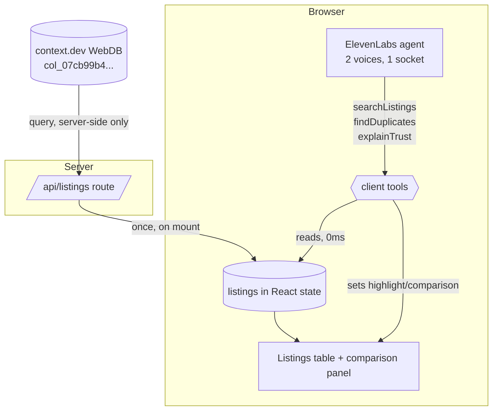

# Second Opinion - Plan

**Product Contract preservation:** unchanged. No requirement was added, removed, resplit, or
rescoped during enrichment. The two Outstanding Questions were planning-owned and are resolved
below as KTD2 and KTD3.

## Goal Capsule

**Objective.** Ship a voice agent that answers questions about Dubai rental listings instantly,
tells you when the same apartment is being advertised by more than one agency at different prices,
and audibly signals when a listing's data is too incomplete to trust — demoable by 14:30 on
2026-08-08.

**Product authority.** This plan owns the voice agent and its screen. The listings substrate
(a context.dev WebDB collection over five Dubai communities) already exists and is syncing; this
plan consumes it and does not redesign it.

**Open blockers.** None.

---

## Product Contract

### Summary

Second Opinion is a voice agent over a pre-read table of Dubai rental listings. It answers
questions in about a second, flags when two listings describe the same apartment at different
prices, and shifts to an audibly less certain voice — naming the reason — on listings missing
key facts. It sides with the renter: it says what to check, never what to do.

### Problem Frame

Dubai rental portals list the same physical apartment multiple times. Different agencies advertise
the same unit, sometimes at materially different rents, and nothing on the portal indicates the
listings are the same property. A renter comparing options has no way to tell that the flat they
are being quoted at one price is available elsewhere for less, so they negotiate against a number
someone else already beat.

The listings themselves are also unevenly published. Across 200 sampled rows, 22 carry no posting
date and 9 name no agency. A renter cannot tell a fresh listing from one that has sat for months,
which is precisely the signal that would tell them whether an asking price is real.

Existing tools optimise for search and discovery. None of them tell you that two results are one
apartment, and none of them tell you when a listing is too thin to rely on.

### Key Decisions

- **The agent takes the renter's side.** Warm and helpful rather than neutral, on the grounds that
  a tool whose purpose is protecting the user should sound like it. *(session-settled:
  user-directed — chosen over a neutral or dryly-witty register.)* Governs R12.
- **It says what to check, never what to do.** *(session-settled: user-directed — chosen over
  facts-only and over explicit recommendations.)* Governs R13.
- **Hedging keys on named data defects, not on the extraction confidence score.** The observed
  confidence band (0.77–0.93) is too narrow for a threshold to feel meaningful or to be defensible
  aloud, and a defect the agent can name is checkable by the listener. *(session-settled:
  user-directed — chosen over thresholding the raw score, a blended score, and duplicate-match
  confidence.)* Governs R8, R9.
- **Bedroom formatting is normalised, not treated as a defect.** Treating it as a defect pushed the
  hedge rate to 52%; excluding it yields 16%. Governs R2, R8.
- **A duplicate claim requires an exact size match; near-matches are stated as probable.**
  *(session-settled: user-directed — chosen over exact-only and over building-plus-bedrooms
  matching.)* Governs R5, R6.
- **The agent reads the table once at page load and answers from memory thereafter.**
  *(session-settled: user-directed — chosen over a fully frozen snapshot and over per-question live
  queries.)* Governs R1, R14.
- **Quiet price-change reporting is out.** *(session-settled: user-directed.)* Governs the Scope
  Boundaries entry.
- **Breadth beats depth at the cut line.** *(session-settled: user-directed.)*

### Actors

- A1. **Renter** — the only human. Speaks to the agent, reads the screen, follows listing links.
- A2. **Second Opinion** — the voice agent.

### Requirements

**The listings table**

- R1. On page load the app reads the current listings once and holds them in memory for the
  session. Every subsequent answer is served from that in-memory copy.
- R2. Bedroom counts are normalised to integers on load (`"1 Bed"` → `1`, `"Studio"` → `0`).
  Prices and sizes are normalised to numbers.
- R3. The app states when the listings were read, in wall-clock terms the user can repeat aloud.
- R4. The user can trigger a re-read without reloading the page.

**Finding the same apartment twice**

- R5. Two or more listings are treated as the same apartment when they share a building, a
  normalised bedroom count, and an identical size. These are stated as fact.
- R6. Listings matching on building and bedrooms whose sizes differ within a small tolerance are
  treated as probably the same apartment, stated with explicit uncertainty and never as fact.
- R7. Every duplicate group reports the price spread between its cheapest and dearest listing, and
  characterises whether that spread is trivial or material rather than presenting all groups as
  equally notable.

**Saying how much it trusts a listing**

- R8. A listing is untrusted when it names no agency, carries no posting date, carries a posting
  date that cannot be read as a date, or states no size.
- R9. When the agent speaks about an untrusted listing it uses an audibly distinct, less certain
  voice and names which fact is missing.
- R10. The screen marks untrusted listings so the signal survives muted playback.
- R11. The agent never presents a listing as untrusted on the basis of formatting variance alone.

**How it talks**

- R12. The agent addresses the renter as an ally: plain language, no jargon, no sales register.
- R13. The agent states facts and may suggest what the user could verify. It does not recommend
  which listing to pursue, does not judge whether a price is good, and does not attribute motive
  to any agency.
- R14. The agent answers from the in-memory table with no network call in the conversational path.
- R15. When results the user just asked for contain a duplicate group, the agent mentions it
  unprompted. It volunteers nothing else.
- R16. A follow-up question inherits the previous question's filters unless the user replaces them.
- R17. When asked something outside what it holds, the agent says what it does not have, then
  offers the nearest thing it does.
- R18. When one agency has listed the same apartment more than once, the agent identifies that
  specifically rather than folding it in with other duplicates. It states the fact and stops.

**The screen**

- R19. The screen shows the listings under discussion, reacting as the agent speaks.
- R20. When a duplicate group is discussed, its listings lift into a side-by-side comparison that
  makes the identical attributes and the differing price visible at a glance.
- R21. Every listing on screen links to its source page so a reader can verify the claim.

### Key Flows

- F1. **Ask about an area.** **Trigger:** the user asks about a community, optionally with a
  bedroom count. Agent answers with the count and the typical price, states how recently it read
  the listings, and — if the result set contains a duplicate group — names it unprompted.
  **Covers R1, R3, R14, R15.**
- F2. **Pull a duplicate apart.** **Trigger:** the user asks about duplicates, or follows up on one
  the agent volunteered. Agent names the building, size and bedroom count, gives each price with
  its agency, and reports the spread with a judgement of whether it is material. The screen lifts
  the group into side-by-side comparison with links. **Covers R5, R7, R20, R21.**
- F3. **Meet a thin listing.** **Trigger:** an untrusted listing appears in what the agent is about
  to say. Agent shifts to the less certain voice, names the missing fact, and suggests what to
  verify. The screen marks the row. **Covers R8, R9, R10, R13.**
- F4. **Ask for something it doesn't have.** **Trigger:** the user asks about an uncovered area, a
  photo, or whether a price is good. Agent states the boundary, then offers the nearest thing it
  holds. **Covers R17.**

### Acceptance Examples

- AE1. Marina has 104 one-bedroom listings and one duplicate group among them. The user asks
  "what's a one-bed in Marina?" The agent gives the count and typical price, then says two of them
  are the same apartment — without being asked. **Covers R15.**
- AE2. Two listings share a building and bedroom count; one says 700 sqft, the other 703. The agent
  says they are *probably* the same apartment and names the size difference. **Covers R6.**
- AE3. A duplicate group's two prices differ by AED 2,000. The agent reports the group but
  characterises the gap as ordinary. **Covers R7.**
- AE4. A listing names no agency and carries no posting date. When the agent mentions it, the voice
  changes and it says both facts are missing. **Covers R8, R9.**
- AE5. A listing writes its bedroom count as `"2 Beds"` while others write `"2"`. The agent treats
  it as an ordinary listing and does not hedge. **Covers R11.**
- AE6. The user asks "what about Sharjah?" The agent says it does not cover Sharjah, names what it
  does cover, and offers a specific alternative. **Covers R17.**
- AE7. The user asks "what's a 2-bed in Marina?" then only "what about JLT?" The agent answers
  about two-bedroom listings in JLT. **Covers R16.**
- AE8. One agency has listed the same apartment twice at different prices. The agent states the
  agency, that both listings are theirs, and the gap — and offers no explanation. **Covers R18.**
- AE9. The user asks whether a listing is a good deal. The agent declines to judge and offers what
  it can show instead. **Covers R13.**

### Scope Boundaries

**Deferred for later**

- Reporting what changed since an earlier read.
- Communities beyond the five currently covered.
- Any second portal.
- Telephone access.

**Outside this product's identity**

- Recommending which listing to pursue, or valuing whether a price is fair.
- Any claim about an agency's motives, including the word "bait".
- Accounts, saved searches, alerts, or persistence between sessions.
- Search and discovery as a primary purpose.

**Deferred to follow-up work**

- Automated conversation evals via the ElevenLabs Tests API. Worth it with more time; not inside
  the deadline.
- Server-side caching of the listings read. One read per page load is acceptable at demo scale.

---

## Planning Contract

### Key Technical Decisions

- **KTD1. The agent's tools run in the browser, not on the server.** ElevenLabs client tools
  execute synchronously in the page against the already-loaded listings array, so a voice turn
  makes no network call at all, and the same call updates React state that drives the screen.
  Server tools would add a round trip per turn and split data access from UI updates.
  **Governs R14, R19, R20.**
- **KTD2. The uncertain voice is a second voice on one agent, addressed by inline markup.**
  ElevenLabs multi-voice supports up to 10 labelled voices per agent with mid-sentence switching,
  so there is one agent, one socket, and no transfer latency — but the listener hears a genuinely
  different voice rather than a modulation of the same one. Provisioning is one config field.
  *(session-settled: user-approved — chosen over delivery markup on a single voice: the user asked
  for a change you cannot miss, and a single voice risks being inaudible through laptop speakers on
  a compressed video.)* **Governs R9.**
- **KTD3. Duplicate tolerance is an absolute 3 square feet, not a percentage.** Derived from the
  data: across 43 same-building/same-bedroom adjacent pairs, 16 match exactly, 10 differ by 1–3
  sqft regardless of unit size (1625→1626, 851→852, 1421→1422 — rounding artifacts), and the rest
  differ by materially more. A percentage tolerance would allow 17 sqft on a 1,723 sqft unit, which
  is a different layout. Exact matches are stated as fact; 1–3 sqft matches are stated as probable.
  **Governs R5, R6.**
- **KTD4. The agent's configuration is committed to the repo and applied by a re-runnable script.**
  Prompt, tool schemas, and voice labels live in version control rather than a dashboard, so the
  agent's behaviour is reviewable as a diff. This is the primary evidence of deliberate tool
  steering, which the judging rubric scores directly.
- **KTD5. Tests cover the pure functions only.** Normalisation, trust classification, and duplicate
  grouping are pure, deterministic, and where every judged decision lives. The voice agent and the
  UI get no test scaffolding — inside the deadline that would buy ceremony rather than confidence.
- **KTD6. The context.dev key never reaches the browser.** One server route proxies the query; the
  client receives normalised listings and never an API key. Required by the vendor's own guidance
  and the obvious security posture.
- **KTD7. The listings read happens once, in a server route called on mount, and the result is held
  in React state.** Satisfies read-once semantics while keeping the re-read affordance (R4) as a
  re-invocation of the same route.

### High-Level Technical Design



The one load-bearing property: **no arrow crosses the Browser boundary during a conversation.**
The only server call happens on mount and on an explicit re-read.

Normalisation and classification pipeline:

```mermaid
flowchart LR
    RAW[raw row<br/>all strings] --> N[normalise]
    N --> L[Listing<br/>beds:int price:int size:int]
    L --> T[classifyTrust]
    L --> D[groupDuplicates]
    T --> TV[trusted | untrusted + reasons]
    D --> EX[exact group → stated as fact]
    D --> PR[≤3sqft group → stated as probable]
```

### Output Structure

```text
app/
  api/listings/route.ts      server proxy + normalisation entry
  page.tsx                   the single screen
  layout.tsx
components/
  ListingsTable.tsx
  DuplicateComparison.tsx
  VoiceWidget.tsx
lib/
  listings/
    types.ts                 Listing, TrustVerdict, DuplicateGroup
    normalize.ts             pure
    normalize.test.ts
    trust.ts                 pure
    trust.test.ts
    duplicates.ts            pure
    duplicates.test.ts
    context-client.ts        server-only context.dev client
agent/
  second-opinion.json        committed agent config
  sync-agent.ts              idempotent provisioning script
scripts/
  check-hero.ts              pre-record verification
```

---

## Implementation Units

### U1. App spine, listings proxy, and normalisation

- **Goal.** A page that loads, reads the listings once, and shows them in a plain table with a
  read-at timestamp.
- **Requirements.** R1, R2, R3, R4, R21. KTD6, KTD7.
- **Dependencies.** None.
- **Files.** `app/page.tsx`, `app/layout.tsx`, `app/api/listings/route.ts`,
  `lib/listings/types.ts`, `lib/listings/context-client.ts`, `lib/listings/normalize.ts`,
  `lib/listings/normalize.test.ts`, `components/ListingsTable.tsx`, `.env.example`.
- **Approach.**
  1. Scaffold Next.js App Router + TypeScript. No CSS framework decision worth making — plain CSS
     modules or inline styles are fine.
  2. `context-client.ts` holds the single query call. Server-only.
  3. `normalize.ts` maps a raw row to `Listing`: bedrooms to int (digit extraction, `studio` → 0),
     price and size to int (strip non-digits), keep `_url` as `sourceUrl`, keep `_meta` confidence
     untouched for later use.
  4. The route returns `{ listings, readAt }`. The page fetches on mount, holds in state.
  5. Table renders every listing with its source link.
- **Patterns to follow.** None in-repo — this is the first code. Establish the convention the rest
  follows: pure functions in `lib/`, no I/O below the route layer.
- **Test scenarios.**
  - `"1 Bed"`, `"1"`, `"1 Bedroom"` all normalise to `1`.
  - `"Studio"` normalises to `0`.
  - `"AED 76,000"` and `"76000"` both normalise to `76000`.
  - A missing or empty size normalises to `null`, not `0` — `0` would corrupt duplicate matching.
  - A row missing every optional field still produces a valid `Listing`.
  - Normalising the full 200-row fixture produces 200 listings with no thrown error.
- **Verification.** The page shows a table of listings and a timestamp the user can read aloud.

### U2. Voice agent answering from memory

- **Goal.** End-to-end voice works: you speak, it answers about the listings, with no network call
  in the turn.
- **Requirements.** R12, R14, R16, R17, R19. KTD1, KTD4.
- **Dependencies.** U1.
- **Files.** `components/VoiceWidget.tsx`, `agent/second-opinion.json`, `agent/sync-agent.ts`,
  `app/page.tsx` (wire the widget).
- **Approach.**
  1. `agent/second-opinion.json` holds the system prompt, the client-tool schemas, and the voice
     labels. `sync-agent.ts` applies it idempotently and logs what it changed.
  2. System prompt carries the persona (R12: ally, plain language, no sales register), the
     boundaries (R13: never recommend, never judge price, never impute motive), and the
     out-of-scope behaviour (R17: name what you don't have, then offer the nearest thing).
  3. One client tool to start: `searchListings({ community?, bedrooms?, maxPrice? })` returning a
     compact summary — count, median price, and up to N listings. Keep the returned payload small;
     a large tool result slows the model's next turn even though the tool itself is instant.
  4. Conversation context (R16) is handled by the model, not by app state — the prompt instructs it
     to carry prior filters unless replaced.
- **Execution note.** Get one round-trip of real speech working before adding a second tool. This
  is the unit most likely to surprise; everything after it is incremental.
- **Test scenarios.** `Test expectation: none — this unit is agent configuration and a third-party
  React component. Its behaviour is verified by speaking to it, and the tool logic it calls is
  tested in U1, U3, and U4.`
- **Verification.** You ask about a community out loud and hear a correct answer, with no network
  request in the browser devtools during the turn.

### U3. Trust classification and the uncertain voice

- **Goal.** The agent sounds different, and says why, on listings missing key facts.
- **Requirements.** R8, R9, R10, R11, R13. KTD2.
- **Dependencies.** U1, U2.
- **Files.** `lib/listings/trust.ts`, `lib/listings/trust.test.ts`,
  `components/ListingsTable.tsx` (untrusted marking), `agent/second-opinion.json` (second voice +
  prompt rule).
- **Approach.**
  1. `classifyTrust(listing)` returns `{ trusted: boolean, reasons: TrustReason[] }`. Reasons are a
     closed union — `no_agency`, `no_date`, `unreadable_date`, `no_size` — each carrying the plain
     phrase the agent speaks ("doesn't say when it was posted").
  2. Bedroom formatting is **not** a reason. R11 is enforced here, and the test below is what stops
     a later contributor re-adding it.
  3. Add the second voice label to the agent config. The prompt instructs: when speaking about a
     listing whose trust verdict is untrusted, switch to the uncertain voice for that clause and
     name the reason.
  4. Include the trust verdict in every tool result so the model knows which listings to hedge on
     without an extra call.
  5. Table marks untrusted rows visibly (R10).
- **Test scenarios.**
  - A listing with no agency is untrusted with reason `no_agency`.
  - A listing with an empty `listedRelative` is untrusted with reason `no_date`.
  - A listing whose `listedRelative` is `"/"` is untrusted with reason `unreadable_date`.
  - A listing with `"2 Beds"` and every other field present is **trusted** — formatting variance
    alone never triggers a reason. **Covers AE5.**
  - A listing missing both agency and date carries both reasons, in a stable order.
  - Against the 200-row fixture, the untrusted rate is between 10% and 25% — a guard that catches
    both a rule that stopped firing and a rule that started over-firing. **Covers R11.**
- **Verification.** Ask about a community containing a thin listing and hear the voice change on
  that listing, with the missing fact named.

### U4. Duplicate detection and the comparison view

- **Goal.** The hero beat: the same apartment, two agencies, two prices, side by side.
- **Requirements.** R5, R6, R7, R18, R20, R21. KTD3.
- **Dependencies.** U1, U3.
- **Files.** `lib/listings/duplicates.ts`, `lib/listings/duplicates.test.ts`,
  `components/DuplicateComparison.tsx`, `agent/second-opinion.json` (tool + prompt rules).
- **Approach.**
  1. `groupDuplicates(listings)` returns `DuplicateGroup[]`, each carrying `confidence:
     'exact' | 'probable'`, the shared building/bedrooms/size, the member listings, the spread, and
     `sameAgency: boolean`.
  2. Grouping key is normalised building name plus bedroom count. Within a key, members whose sizes
     are identical form an `exact` group; members within 3 sqft form a `probable` group (KTD3).
  3. Spread is dearest minus cheapest. Classify `material` above a threshold and `ordinary` below —
     pick the threshold from the live distribution when implementing, and state it in the code.
  4. `sameAgency` is true when every member shares an agency name (R18).
  5. Second client tool `findDuplicates({ community?, bedrooms? })`, which also sets the comparison
     panel state so the screen and the speech move together.
  6. Prompt rules: exact groups stated as fact; probable groups stated with explicit uncertainty in
     the uncertain voice; `sameAgency` groups called out specifically and without explanation.
- **Test scenarios.**
  - Two listings, same building, same bedrooms, identical size → one `exact` group.
  - Same building and bedrooms, sizes 700 and 703 → one `probable` group. **Covers AE2.**
  - Same building and bedrooms, sizes 700 and 714 → **no** group. Guards KTD3's absolute tolerance
    against being loosened to a percentage.
  - Same building, different bedroom counts → no group.
  - Building names differing only in case or punctuation still group.
  - A listing with a null size never joins a group.
  - A group whose members share an agency sets `sameAgency`. **Covers AE8.**
  - A group with a 2,000 spread classifies as ordinary; the West Avenue 24,000 pair classifies as
    material. **Covers AE3.**
  - Against the 200-row fixture, at least one material group is found — a canary for the demo.
- **Verification.** Ask about duplicates and see two listings lift into side-by-side comparison with
  working source links, while the agent narrates the spread.

### U5. Conversational polish

- **Goal.** It volunteers, it stays in bounds, and it sounds like an ally rather than a database.
- **Requirements.** R7, R12, R13, R15, R16, R17, R18.
- **Dependencies.** U2, U3, U4.
- **Files.** `agent/second-opinion.json`, `components/ListingsTable.tsx`.
- **Approach.**
  1. Volunteering (R15) is made deterministic: `searchListings` includes any duplicate groups
     present in the result set, and the prompt instructs the agent to mention them once. It
     volunteers nothing else — this is the guard against it stepping on the demo script.
  2. Tighten the persona: short sentences, no jargon, no sales register.
  3. Boundary rehearsal: verify the four out-of-scope shapes — an uncovered community, a photo
     request, a "is this a good deal" question, and a question about a field it doesn't hold.
  4. Spread characterisation phrasing (R7) so trivial groups are not delivered like findings.
- **Execution note.** This is the first unit to cut at 14:00. Everything here improves an already
  working product.
- **Test scenarios.** `Test expectation: none — prompt and copy tuning, verified by speaking to it.`
- **Verification.** Run the four boundary questions and the volunteering case out loud; each lands
  without a stumble.

### U6. Demo readiness

- **Goal.** You find out your hero example is missing at 13:45, not on camera — and the repo reads
  well to a judge.
- **Requirements.** Supports the whole plan; no product requirement of its own.
- **Dependencies.** U4.
- **Files.** `scripts/check-hero.ts`, `docs/ideation/demo-script.md`, `README.md`.
- **Approach.**
  1. `check-hero.ts` reads the live listings, runs the same `groupDuplicates` the app uses, and
     prints every material group with its building, sizes, prices, agencies, and spread — plus a
     one-line verdict on whether a demo-worthy example exists. Reusing the real function is the
     point: a bespoke check could pass while the app fails.
  2. Rewrite the demo script's hedge beat. Its current DAMAC Heights line cites bedroom formatting,
     which R11 excludes. Replace with a real trigger — a missing posting date or a missing agency —
     and the renter-relevant reason. Also correct the liveness claim to "read once when the page
     loaded" and remove the dropped change-feed beat.
  3. `README.md` states what the thing does, the one architectural idea worth knowing (no network
     in the voice path), how to run it, and where the tested logic lives. Written for a judge
     skimming for 90 seconds.
- **Execution note.** Run `check-hero` once when U4 lands and again right before recording.
- **Test scenarios.** `Test expectation: none — a reporting script and documentation.`
- **Verification.** `check-hero` names at least one material duplicate group. The demo script
  contains no claim the build contradicts.

---

## Sequencing and the cut line

| Time | Target |
|---|---|
| 11:50–12:20 | U1 — data on screen |
| 12:20–12:50 | U2 — voice answering |
| 12:50–13:15 | U3 — trust + uncertain voice |
| 13:15–13:45 | U4 — duplicates + comparison |
| 13:45–14:00 | U6 — hero check, script rewrite, README |
| 14:00–14:30 | Record and submit |

**U5 is the designated casualty.** If anything runs long, it is cut whole rather than half-built.
U6 is not cuttable — an unverified hero example and a demo script that contradicts the build are
worse than a rough edge in the product.

**If U4 is not working by 13:45**, ship U1–U3 and rewrite the demo around the uncertain-voice beat
alone. That is still a complete, honest product; a broken duplicate reveal is not.

---

## Verification Contract

- Every pure function in `lib/listings/` passes its tests, and the suite runs without network
  access.
- A voice turn produces no network request in browser devtools. **This is the claim the
  architecture exists to support — verify it by watching, not by assuming.**
- The five acceptance examples with deterministic inputs (AE2, AE3, AE5, AE8, and the R11 rate
  guard) are covered by tests in U3 and U4.
- The four conversational acceptance examples (AE1, AE6, AE7, AE9) are verified by speaking to the
  agent, once, before recording.
- `scripts/check-hero.ts` reports at least one material duplicate group.
- The app runs from a clean clone with only `CONTEXT_DEV_API_KEY` and the ElevenLabs agent id set.

## Definition of Done

- Speaking a question about a covered community returns a correct spoken answer with no network
  call in the turn.
- The agent identifies at least one duplicate group as fact, and the screen shows those listings
  side by side with working source links.
- The agent's voice audibly changes on an untrusted listing and names the missing fact.
- `pnpm test` passes.
- `README.md` and `docs/ideation/demo-script.md` describe the product as built, with no claim the
  code contradicts.
- The repo is pushed to GitHub and the demo video is recorded.

---

## Open Questions

**Deferred to implementation**

- The spread threshold separating a material duplicate from an ordinary one. Pick it from the live
  distribution while implementing U4 and state it in the code.
- Whether the comparison panel is a modal, a pinned strip, or an inline expansion. Any is fine;
  pick whichever renders fastest and looks deliberate.

## Sources & Research

- `docs/ideation/context-dev-probe-results.md` — measured latency, cost, response shapes, query
  filter syntax, and the WebDB gotchas found by probing (`seeds` not `urls`, `dir` not `direction`,
  `limit` max 200).
- `docs/ideation/2026-08-08-voice-agent-hackathon-ideation.md` — the candidate set and rejection
  rationale.
- `docs/ideation/demo-script.md` — the spoken demo script. U6 revises it.
- Size-gap distribution behind KTD3, measured 2026-08-08 across 43 same-building/same-bedroom
  adjacent pairs: 16 exact, 10 within 1–3 sqft, 17 beyond.
