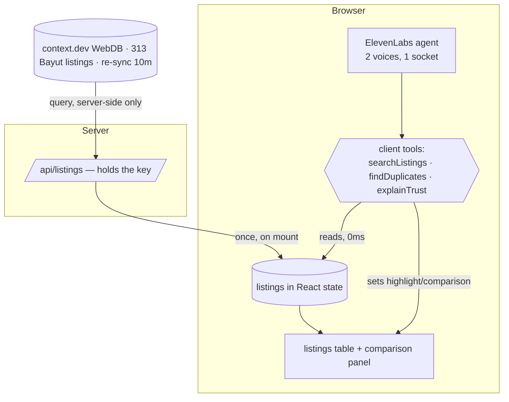

# Second Opinion — Technical Specification

Dubai AI Hub Builder Lab #3 · Voice Agents Hackathon · 2026-08-08

---

## 01 · Problem

**Who.** Someone renting an apartment in Dubai, comparing listings on a portal, about to call an
agent about one of them.

**The pain.** The same physical apartment appears on the portal more than once. Different agencies
list the same unit, sometimes at materially different rents, and nothing on the page indicates the
listings are the same flat. Measured on the live collection: **30 exact duplicate groups covering 67
of 313 listings — 21% of the table is a repeat.** One 855 sqft one-bedroom at Imperial Avenue is
listed three times by two agencies at 110,000, 130,000 and 145,000 dirhams. A renter calling about
the 145,000 listing is negotiating against a number someone else already beat by 35,000.

The listings are also unevenly published. 39 of 313 carry no posting date and 15 name no agency, so
you can't tell a fresh listing from one that's sat unclaimed for months — which is exactly the signal
that tells you whether an asking price is real.

Existing tools optimise for search and discovery. They're good at showing you more listings. None of
them tell you that two of the results are one apartment.

**Why voice.** Two reasons, and only the second one is interesting.

The weak reason: this happens while you're doing something else — walking a building, sitting in a
car outside a viewing, on hold with an agency. Hands and eyes are busy.

The real reason: **the product's core output is a confidence signal, and voice carries confidence in
a channel that text doesn't have.** A screen can print "78% confident" but the reader has to stop,
decode it, and decide what it means. A voice that audibly slows and softens on one clause tells you
the same thing before you've finished hearing the sentence, without spending any of your attention.
The thing this product most needs to communicate — *don't lean on this one* — is precisely the thing
speech does better than text. That's what makes it a voice product rather than a web app with a
microphone bolted on.

---

## 02 · Architecture

One property governs every decision: **no network call occurs inside a voice turn.**

`/web/search` on context.dev measures 2–4 seconds. Any design shaped *user asks → search → answer*
produces audible dead air, and dead air is what makes voice demos feel broken. So the read moves out
of the conversational path entirely: the listings are fetched once when the page mounts, normalised
into typed records, and held in React state for the session.

The agent's tools are **client** tools, not server tools. They execute synchronously in the browser
against that in-memory array. A voice turn therefore makes zero HTTP requests — and because the same
function call that answers the question also sets React state, the screen and the speech move
together instead of racing each other.



**No arrow crosses the Browser boundary during a conversation.** The only server call happens on
mount, and again on an explicit "read them again."

The pipeline below that is three pure functions, and they are where every judged decision lives:

```
raw row (all strings)
  → normalize()   "1 Bed"→1, "Studio"→0, "AED 76,000"→76000, missing size→null (never 0)
  → classifyTrust()  → { trusted, reasons: no_agency | no_date | unreadable_date | no_size }
  → groupDuplicates() → exact match  → stated as fact
                        ≤3 sqft gap  → stated as probable, in the uncertain voice
```

Two decisions inside that are load-bearing:

**Duplicate tolerance is an absolute 3 sqft, not a percentage.** Measured across 43
same-building/same-bedroom adjacent pairs: 16 match exactly, 10 differ by 1–3 sqft *regardless of unit
size* (1625→1626, 851→852, 1421→1422 — rounding artifacts), and the rest differ by materially more.
A percentage tolerance would admit 17 sqft on a 1,723 sqft unit, which is a different floor plan.

**Hedging keys on named defects, not on the extraction score.** context.dev returns per-field
confidence, and using it directly is the obvious move. It's wrong here: the observed range is
0.68–0.95, clustered in the middle, so any threshold is arbitrary and indefensible if a judge asks
where the number came from. Worse, it's unverifiable by the listener. "It doesn't say when it was
posted" is a claim you can check by opening the link. That's the one worth speaking aloud.

The one place this yields to formatting: bedroom counts. The source writes `1`, `1 Bed`, `2`,
`2 Beds` and `Studio`; 111 of 313 rows use a worded form. Counting that as a defect pushes the hedge
rate from 16% to 52% and the uncertain voice stops meaning anything. It's normalised, and there's a
test whose only job is to stop someone re-adding it later.

---

## 03 · Tool rationale

### context.dev — WebDBs, specifically

The obvious use of context.dev is `/web/search`, and it's the wrong one: 2–4s latency, and it's the
one surface Exa, Tavily and Firecrawl all do equally well. Building on it would produce both a slow
demo and the weakest possible claim to using this sponsor's product meaningfully.

**WebDBs** is the surface that matters, and it's `x-hidden` in the OpenAPI spec and absent from
`llms.txt` — found by reading the spec rather than the docs. It turns a scrape target into a synced,
queryable, typed collection. Probed live:

| | |
|---|---|
| `POST /webdbs/collections/{id}/query` | **0.52s, 0 credits** |
| Row metadata, free | `extraction_confidence`, per-field confidence, `change_count`, `last_changed_at` |
| Change history | field-level `from`→`to` diffs, 90-day retention |
| Rejections endpoint | pages that failed eligibility — the agent can say *why* it distrusted a source |

That first row is the whole reason this product is possible in a voice format. A 0.5s query at zero
credits is what lets the listings be read on mount without a budget conversation, and the structured
per-field confidence is what a naive build would have hung the hedging on.

It also removed work rather than adding it: change tracking, versioning and re-sync are built in.
The alternative — Tavily or Apify plus a snapshot store plus a differ — is roughly a day of work and
would still have no history predating the deploy.

### ElevenLabs — multi-voice, specifically

The uncertain voice is **a second labelled voice on a single agent**, addressed by inline markup
mid-sentence. Not a second agent, not a transfer, not prosody markup on one voice.

That choice is deliberate on all three counts. A transfer costs a round trip and a fresh socket in
the middle of a sentence — and `enable_transferred_agent_first_message` defaults to `false`, so the
agent you transfer *to* arrives silent, which is a demo-killer. Prosody markup on a single voice
risks being inaudible through laptop speakers on a compressed video, which is the actual delivery
channel here. Two labelled voices on one socket cost one config field, add no latency, and produce a
change the listener cannot miss.

The wider point: the thing this product must communicate is *epistemic state*, and voice is the only
output channel where that rides along free with the content. That's ElevenLabs being load-bearing
rather than decorative.

Deliberately not used: RAG (there's no corpus — the data is a 313-row table that fits in memory), and
the Tests API for conversation evals (worth it, doesn't fit the window — see 05).

### Devin

Scoped to one delegation, chosen because it's the part of the build with the clearest specification
and the least coupling: **the test suites for the three pure functions in `lib/listings/`.** The plan
already enumerates ~20 concrete test scenarios with named inputs and expected outputs, and the
functions have no I/O, so the task is fully specified in text and independently verifiable — the
suite either goes green against the real implementation or it doesn't.

That's the honest shape of the delegation. Handing it feature work on the voice path would mean
reviewing code in the one area where the deadline has no slack, which trades a bounded task for an
unbounded risk.

---

## 04 · Feasibility — scoping to six hours

Six hours, one person, from an empty repo to a recorded submission. The scope decisions that made
that survivable:

| Phase | Spend | What it bought |
|---|---|---|
| Ideation | ~50 min | 21 candidates, 15 rejected on measured constraints rather than taste |
| Live API probing | ~40 min | Killed three ideas before writing code — `/news/search` 403s, `/web/search` is 2–4s, WebDB query is 0.5s |
| Planning | ~30 min | 21 numbered requirements, 6 units, an explicit cut line |
| Build | ~2h 40m | U1–U6 |
| Record + submit | ~30 min | One take, ~2 min |

**Probing before choosing was the highest-leverage 40 minutes.** Three of the top-ranked ideas
depended on endpoints that turned out to be entitlement-gated or too slow. Discovering that from the
docs at 13:00 instead of from a live probe at 10:40 would have ended the day.

**The cut line was decided before the build, not during it.** Work is ordered so each unit is
demoable on its own: data on screen (U1) → voice answering (U2) → the uncertain voice (U3) → the
duplicate reveal (U4) → polish (U5) → demo verification (U6). U5 is the designated casualty and gets
cut whole rather than half-built. U6 is not cuttable, because an unverified hero example and a demo
script that contradicts the build are worse than a rough edge in the product.

**Explicit fallback:** if the duplicate detection isn't working by 13:45, ship U1–U3 and rebuild the
demo around the uncertain-voice beat alone. That's still a complete, honest product. A half-working
duplicate reveal is not.

**Tests cover the pure functions only.** Normalisation, trust and duplicate grouping are
deterministic, have no I/O, and are where every judged decision lives. The voice agent and the UI get
no test scaffolding — inside this window that buys ceremony rather than confidence, and the honest
verification for a voice agent is talking to it.

**What was cut to fit, and would go in first with more time:** conversation evals, server-side
caching of the listings read, and a second portal.

**Deliberately no database and no auth.** Session state is React state. Nothing persists between
sessions, which is a real product limitation and also removes an entire category of things that can
break on camera.

---

## 05 · Extensibility

**A second portal — and the real prize.** Everything here operates on one source (Bayut), so
"duplicate" currently means *listed twice on the same portal*. Adding Property Finder makes it
*listed on two portals at two prices*, which is both a stronger claim and a more common experience.
The architecture already accommodates it: `groupDuplicates` doesn't know or care where a row came
from, so this is a second WebDB collection and a merge, not a redesign.

**Permit numbers turn inference into proof.** The collection schema already has `permit_number` — a
RERA identifier that uniquely identifies a real unit — but it's populated on only **24 of 313 rows**
(7.7%). Building/bedrooms/size matching is a proxy for the thing the permit number states outright.
Extracting it reliably (it's on the listing page, usually in a trailing details block) would let the
agent say *these are the same unit* as a matter of record rather than inference, and would collapse
the exact/probable distinction entirely.

**The change feed.** `change_tracking` is already enabled with 90-day retention, and **62 of 313 rows
already have `change_count > 0`** — the history exists and is being thrown away. Row history returns
typed, per-field `from`→`to` diffs, so "this flat went up 4,000 dirhams on Tuesday with no note on
the page" needs no diffing logic, just a second query and a way to speak it. This was cut for time,
not for design; it's the single cheapest v2 feature.

**Telephone.** ElevenLabs supports phone numbers, and the natural moment for this product is standing
outside a building with an agent on the other line — not sitting at a laptop. The client-tool
architecture is the one thing that would need rethinking, since there's no browser holding the
listings; the tools would move server-side against a warm cache.

**Conversation evals.** The ElevenLabs Tests API replaces the deprecated `simulate_conversation` and
would let the boundary behaviours be tested rather than rehearsed: that it refuses to judge whether a
price is good, that it names what it doesn't cover, that it inherits filters across follow-ups.
Those are currently verified by speaking to it once before recording, which doesn't survive a
prompt change.

**Where it should not go.** Recommending which flat to take, valuing whether a price is fair, or
characterising why two agencies have the same unit at different numbers. The data supports none of
those, and the product's whole claim to trust rests on it saying only what it can show you.
